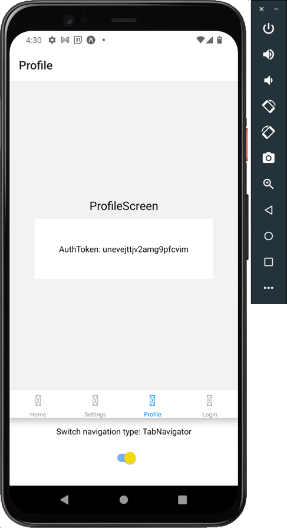

# Webbrowser based login and deep linking

This is a simple example of a web browser based login and deep linking.
This is made to prove the concept of deep linking with different versions of iOS and Android.



## Demo

You can test the login and deep linking by installing the [Expo Client](https://expo.dev/client) on your mobile device and scan the following QR code:

[](https://expo.dev/@vergissberlin/react-native-deep-linking)

## Installation

To install the example, you need to have expo-cli installed.

```bash
npm install -g expo-cli
```

I recommend to use the [Expo Client](https://expo.dev/client) to test the application.
If you want to test the example with simulators, you need to install _Android Studio_ and _xcode_ to get the simulators.
The iOS and Android simulators are not included in the expo-cli package.

Then install the example with the following command:

```bash
yarn install
```

After that, you can run the example with the following command:

```bash
yarn start
```

## Testing

Replace the IP with the IP of your expo instance.

### Deep linking

With the deep linking feature you can link to a specific screen in your app.
Here is an example of how to do this:

```shell
npx uri-scheme open exp://192.168.2.13:19000/--/settings -ai
```

Change the path to switch between screens:

```shell
npx uri-scheme open exp://192.168.2.13:19000/--/home -ai
npx uri-scheme open exp://192.168.2.13:19000/--/login -ai
```
